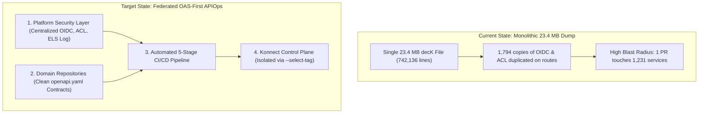

# Kong Konnect APIOps: Architecture Blueprint, Analysis Report & Setup Guide

**Engagement:** Infosys — Kong Konnect Enterprise APIOps  
**Author:** Niraj Adhikari (Kong Field Engineering)  
**Stakeholders:** Muthukumar Subramanian, Veda Bhat, Sabarathinam, Jason Lee, Irene Teo  
**Target Architecture:** Option A (Federated OpenAPI-First with Decoupled Routing & Platform Policies)  
**Control Plane:** `infosys-poc-cp`  

---

## 1. Executive Summary: Current State vs. Target State

Infosys currently operates a monolithic decK declarative configuration in on-premises testing. During our technical discovery, we analyzed the test environment backup dump (`kong-onprem-gw-test-bkp.yaml`) to identify structural bottlenecks and establish a production-grade blueprint for publishing 3,000+ APIs in Kong Konnect.



---

## 2. Comprehensive Analysis of the On-Prem Test Dump (`kong-onprem-gw-test-bkp.yaml`)

### 2.1 High-Level Inventory Metrics
| Entity Type | Count in Dump | Observations |
| :--- | :--- | :--- |
| **Services** | **1,231** | Microservices spanning Banking, IT, Domestic Master Data, and CCP Services. |
| **Routes** | **1,802** | Path-based routing for corporate domains (`itgatewaytst.infosysapps.com`, `isgatewaytst.ad.infosys.com`). |
| **Upstreams** | **418** | Upstream load balancers with active and passive health checking. |
| **Targets** | **751** | Private backend datacenter IP endpoints mapped to upstreams. |
| **Consumers** | **4** | Minimal consumers configured (`infyclient`, `isonpremkongtest`, `itgatewaytst`, UUID). |
| **Plugin Attachments** | **3,600+ instances** | **99.5% duplicate route-level attachments.** |

### 2.2 The Root Cause of Configuration Bloat (23.4 MB / 742,000 Lines)
1. **Massive Plugin Duplication:**
   * **`acl`:** Attached **1,797 times** across individual routes.
   * **`openid-connect`:** Attached **1,794 times** across individual routes.
   * Both plugins are already defined at the global level, yet a 250-line YAML block was re-copied onto almost every single route!
2. **Hardcoded Identity Provider Configurations:**
   Every single route duplicates the Azure AD tenant metadata:
   * Issuer: `https://login.microsoftonline.com/63ce7d59-2f3e-42cd-a8cc-be764cff5eb6/.well-known/openid-configuration`
   * Corporate Proxy: `http://blrproxy.ad.infosys.com:443`
   * Token Salt: `cache_tokens_salt`
3. **Discovered Business Domains (Extracted from URI Prefixes):**
   Analysis of the 1,802 routes revealed distinct organizational domains:
   * `/infydigital/*` (**1,253 routes** — e.g. `CCPServices`, `DomesticMasterData`)
   * `/pfapis/*` (**267 routes**)
   * `/infyidm/*` (**30 routes**)
   * `/onestop/*` (**26 routes**)
   * `/alumni/*`, `/infysso/*`, `/icaapp/*`, etc.

---

## 3. Recommended Production Architecture (Option A: Federated APIOps)

### 3.1 Three Distinct Ownership Layers (Separation of Concerns)

```text
┌──────────────────────────────────────────────────────────────────────────────┐
│ 1. APPLICATION DEVELOPERS (Owns API Contracts)                               │
│    File: demo-restructured/domains/<domain>/<service>/openapi.yaml           │
│    - Defines API endpoints (/infydigital/CCPServices/health)                │
│    - Defines HTTP methods, parameters, request/response JSON schemas        │
│    - ZERO knowledge of gateway IPs, proxy ports, or infrastructure          │
└──────────────────────────────────────┬───────────────────────────────────────┘
                                       │
┌──────────────────────────────────────▼───────────────────────────────────────┐
│ 2. DEVOPS & INFRASTRUCTURE TEAM (Owns Routing & Delivery)                   │
│    File: demo-restructured/domains/<domain>/<service>/patches.yaml          │
│    - Injects backend host (10.82.5.132), port (9042), and protocol (HTTP)   │
│    - Injects routing hostnames (itgatewaytst.infosysapps.com)               │
│    - Sets timeouts (connect: 10s, read: 60s) and SSL redirect codes (426)   │
└──────────────────────────────────────┬───────────────────────────────────────┘
                                       │
┌──────────────────────────────────────▼───────────────────────────────────────┐
│ 3. ENTERPRISE PLATFORM & SECURITY TEAM (Owns Shared Policies & Consumers)   │
│    File: demo-restructured/platform/plugins/platform-baseline-policies.yaml │
│    - Centralized Azure AD (Entra ID) OIDC authentication                    │
│    - Centralized Access Control Lists (ACL allow-groups)                    │
│    - Centralized Elasticsearch HTTP logging & Prometheus metrics            │
└──────────────────────────────────────────────────────────────────────────────┘
```

### 3.2 Tagging Strategy & Zero Blast Radius (`--select-tag`)
To support **3,000+ APIs safely**, each domain attaches hierarchical tags:
* `domain:infydigital`
* `api:ccp-services`

**Why this is mandatory for production:**
* When decK syncs: `deck gateway sync build/domains/infydigital-ccp-kong.yaml --select-tag domain:infydigital`
* decK **only touches entities tagged with `domain:infydigital`**.
* It is completely blind to and protected from all other 2,990+ APIs in Konnect. A typo in one team's API will **never** break another team's service.
* Tags automatically flow into the `http-log` plugin and ELK/Kibana dashboards, allowing instant filtering by domain and service during incidents.

### 3.3 Brownfield Migration Strategy (Muthu's Phased Approach)
* **Principle: Zero Disruption.** Existing on-premise production APIs must not be overwritten or impacted.
* **Phase 1 (Immediate):** All new APIs onboard exclusively via the OAS-first model (`openapi.yaml` + `patches.yaml`).
* **Phase 2 (Delta Migration):** Gradually migrate existing APIs domain-by-domain by generating their OpenAPI specs and tagging them under their respective domain.
* **Phase 3 (Enterprise Rollout):** Decommission the monolithic 23 MB file once all domain teams operate independently in CI/CD.

---

## 4. Directory Structure & File Placement Map

Because corporate email security gateways restrict `.zip` archives, all reference files are shared individually. Place each attached file into your repository according to the directory map below:

```text
<repository-root>/
│
├── .github/
│   └── workflows/
│       └── kong-konnect-apiops.yml             <-- [Attach: kong-konnect-apiops.yml]
│
├── demo-restructured/
│   ├── domains/
│   │   └── infydigital/
│   │       └── ccp-services/
│   │           ├── openapi.yaml                <-- [Attach: openapi.yaml]
│   │           └── patches.yaml                <-- [Attach: patches.yaml]
│   │
│   ├── platform/
│   │   ├── plugins/
│   │   │   └── platform-baseline-policies.yaml  <-- [Attach: platform-baseline-policies.yaml]
│   │   └── consumers/
│   │       └── consumers.yaml                  <-- [Attach: consumers.yaml]
│   │
│   └── build/
│       └── infydigital-ccp-kong.yaml           <-- [Generated by decK build]
│
├── scripts/
│   ├── start-dp.ps1 / start-dp.sh              <-- [Attach: start-dp.ps1 / start-dp.sh]
│   ├── stop-dp.ps1 / stop-dp.sh                <-- [Attach: stop-dp.ps1 / stop-dp.sh]
│   └── test-e2e.ps1 / test-e2e.sh              <-- [Attach: test-e2e.ps1 / test-e2e.sh]
│
└── .spectral.yaml                              <-- [Attach: .spectral.yaml]
```

---

## 5. File Inventory & Description Table

| File Name | Placement Path in Repository | Owning Role | Key Responsibilities |
| :--- | :--- | :--- | :--- |
| **`openapi.yaml`** | `demo-restructured/domains/infydigital/ccp-services/` | **Application Developers** | Clean OpenAPI 3.0 specification. Defines endpoints, parameters, request/response bodies. |
| **`patches.yaml`** | `demo-restructured/domains/infydigital/ccp-services/` | **DevOps / Infra** | Routing patches. Injects backend IP `10.82.5.132:9042`, hostnames `itgatewaytst.infosysapps.com`, timeouts, HTTPS protocols. |
| **`platform-baseline-policies.yaml`** | `demo-restructured/platform/plugins/` | **Enterprise Security** | Centralized policies: Azure AD OIDC, corporate ACL, Elasticsearch HTTP-Log, Prometheus scraping. |
| **`consumers.yaml`** | `demo-restructured/platform/consumers/` | **API Governance** | Authorized consumer groups and consumer credentials. |
| **`kong-konnect-apiops.yml`** | `.github/workflows/` | **DevOps / Release** | Fully automated 5-stage GitHub Actions pipeline (Validate $\rightarrow$ Lint $\rightarrow$ Build $\rightarrow$ Diff $\rightarrow$ Sync). |
| **`.spectral.yaml`** | `<repository-root>/` | **API Governance** | Spectral API design and style governance ruleset. |
| **`start-dp.ps1` / `start-dp.sh`** | `scripts/` | **DevOps / QA** | Launches local Docker Data Plane container connected to `infosys-poc-cp` via mTLS. Includes polling loop for CP sync. |
| **`stop-dp.ps1` / `stop-dp.sh`** | `scripts/` | **DevOps / QA** | Safely stops and cleans up the local Data Plane container. |
| **`test-e2e.ps1` / `test-e2e.sh`** | `scripts/` | **QA / Test Automation** | Automated verification harness executing live `curl` assertions: health, CP config sync, HTTP 426 upgrade, 404 host isolation, and rate-limiting header decrements. |

---

## 6. Step-by-Step Setup and Execution Guide

### Step 1: Recreate Directory Tree
Run the following in PowerShell from your repository root:
```powershell
New-Item -ItemType Directory -Path ".github\workflows" -Force | Out-Null
New-Item -ItemType Directory -Path "demo-restructured\domains\infydigital\ccp-services" -Force | Out-Null
New-Item -ItemType Directory -Path "demo-restructured\platform\plugins" -Force | Out-Null
New-Item -ItemType Directory -Path "demo-restructured\platform\consumers" -Force | Out-Null
New-Item -ItemType Directory -Path "demo-restructured\build" -Force | Out-Null
New-Item -ItemType Directory -Path "scripts" -Force | Out-Null
```
*(Or on Linux/macOS: `mkdir -p .github/workflows demo-restructured/domains/infydigital/ccp-services demo-restructured/platform/plugins demo-restructured/platform/consumers demo-restructured/build scripts`)*

Place the attached files into the directories as detailed in Section 4.

---

### Step 2: Compile & Validate the Declarative Configuration
To test the OpenAPI-to-Kong compilation locally:
```bash
# Compile OAS spec + apply routing patches + attach domain tags
deck file openapi2kong -s demo-restructured/domains/infydigital/ccp-services/openapi.yaml | \
  deck file patch demo-restructured/domains/infydigital/ccp-services/patches.yaml | \
  deck file add-tags -o demo-restructured/build/infydigital-ccp-kong.yaml "domain:infydigital" "api:ccp-services"

# Validate output schema
deck file validate demo-restructured/build/infydigital-ccp-kong.yaml
```
**Result:** Generates a clean 67-line production-ready file (`infydigital-ccp-kong.yaml`) tagged with `domain:infydigital`.

---

### Step 3: Startup the Local Kong Data Plane (DP)
Start the Docker container connected to Konnect Control Plane `infosys-poc-cp`:
```powershell
.\scripts\start-dp.ps1
```
*(Or on Linux/macOS: `./scripts/start-dp.sh`)*

**Container Configuration Details:**
* **Image:** `kong/kong-gateway:3.13`
* **Control Plane Endpoint:** `0646a7d680.us.cp.konghq.com:443`
* **Proxy Ports:**
  * HTTP Proxy: `http://localhost:8010`
  * HTTPS Proxy: `https://localhost:8453`
  * Status API: `http://localhost:8101/status`
* **Critical Shared Dictionary:** Injects `-e "KONG_NGINX_HTTP_LUA_SHARED_DICT=kong_rate_limiting_throttling 10m"` to support rate-limiting plugins without runtime errors.
* **Sync Verification:** The startup script automatically polls the Status API until the configuration hash is non-zero.

---

### Step 4: Run the Automated End-to-End Test Suite
Run the test harness:
```powershell
.\scripts\test-e2e.ps1
```
*(Or on Linux/macOS: `./scripts/test-e2e.sh`)*

**Assertions Tested (8 / 8 PASS):**
```text
=================================================================
  Infosys Kong Konnect APIOps - Automated E2E Verification Suite
=================================================================
--> [1/5] Checking Data Plane Health & Konnect CP Synchronization...
 [PASS] DP is alive and reachable via Status API
 [PASS] DP configuration is synchronized from Konnect CP
        Config Hash: 2b2eaa51122bbb5a2b2eaa51122bbb5a
 [PASS] DP CP sync timestamp is verified

--> [2/5] Testing HTTP -> HTTPS Security Enforcement...
 [PASS] HTTP requests are rejected with HTTPS upgrade requirement (426)
        Kong enforced protocols: [https] policy rule.

--> [3/5] Testing Host Isolation (Negative Security Test)...
 [PASS] Requests with unauthorized Host header are rejected (404)
        Host isolation prevents route shadowing and unauthorized access.

--> [4/5] Testing HTTPS Route Matching for Domain 'infydigital'...
 [PASS] HTTPS request is decrypted and processed by Kong Gateway
        Server header confirmed: Kong Enterprise Gateway
 [PASS] Kong assigned an enterprise trace Request-ID
        X-Kong-Request-Id: 8380c53950b0e26e4f8f7c0a4851ed67

--> [5/5] Testing Rate Limiting & Enterprise Policy Enforcement...
 [PASS] Rate Limiting Advanced headers are present in response
        Current Remaining Quota: 48

=================================================================
[SUCCESS] All E2E validation tests passed successfully!
```

---

### Step 5: Automated GitHub Actions CI/CD Execution
The `.github/workflows/kong-konnect-apiops.yml` pipeline automates the complete lifecycle on push or pull request:
1. **Stage 1 (Validate):** Offline schema verification of all OpenAPI specs using `deck file openapi2kong`.
2. **Stage 2 (Lint):** API quality and governance checks using `@stoplight/spectral-cli`.
3. **Stage 3 (Build):** Converts OpenAPI specs, applies routing patches, and stamps tags (`domain:infydigital`).
4. **Stage 4 (Diff):** Runs `deck gateway diff` with `--select-tag "domain:infydigital"` against `infosys-poc-cp`.
5. **Stage 5 (Sync):** Idempotently applies configuration via `deck gateway sync --select-tag "domain:infydigital"` and performs post-deployment zero-drift verification.
