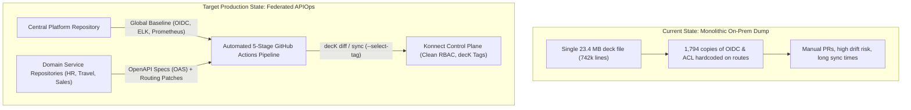

# Infosys Production Architecture & API Publishing Blueprint (Konnect)

**Date:** October 1, 2026  
**Author:** Niraj Adhikari (Kong Field Engineering)  
**Stakeholders:** Muthukumar Subramanian, Veda Bhat, Sabarathinam, Jason Lee, Irene Teo  
**Objective:** Transition from monolithic on-prem configuration (23MB dump) to a scalable, automated, and decoupled production publishing model in Kong Konnect.

---

## 1. Current State vs. Target Production State



---

## 2. Architecture Comparison: Gap Analysis

| Architectural Dimension | Current Monolith (`kong-onprem-gw-test-bkp.yaml`) | Target Production Blueprint (Konnect Supported Way) |
| :--- | :--- | :--- |
| **File Structure** | 1 monolithic file (742k lines, 23.4 MB). | Decoupled: Central platform base (`platform/`) + domain OpenAPI specs (`apis/<domain>/`). |
| **Plugin Scoping** | **Anti-pattern:** 1,794 instances of OIDC & ACL duplicated on routes. | **Tiered Governance:** Global baseline (ELK, Prometheus, mTLS), Service-level OIDC, and Route-level overrides only when needed. |
| **decK Execution** | High blast radius: one command touches all 1,231 services. | **Selective decK Sync:** Isolated by `--select-tag <domain>` (e.g. `team:travel`, `team:hr`). |
| **Authentication** | Hardcoded Azure AD tenant & salt strings on 1,800 routes. | Managed via `_plugin_configs` template or centralized Key Vault secrets. |
| **Observability** | Static `http-log` pushing directly to Elasticsearch on-prem. | Platform-managed `http-log` / `opentelemetry` with buffered queueing. |
| **Pipeline Governance**| Manual and ad-hoc scripts. | Automated 5-stage CI/CD: Validate ➔ Lint ➔ Build ➔ Diff ➔ Sync. |

---

## 3. The 3 Architectural Proposals for Infosys Production Publishing

### Option A: Fully Federated Multi-Repo Model (Recommended for 3,000+ APIs)
* **Structure:** Each domain team (e.g., Travel, HR, Banking) owns their API specification and routing patches in their own Git repository.
* **Mechanism:**
  - Application developers commit their OpenAPI Spec (`openapi.yaml`).
  - GitHub Actions runs Stage 1 (Validate) & Stage 2 (Spectral Lint).
  - The pipeline pulls the platform team's shared baseline policies and runs `deck gateway sync --select-tag domain:<name>`.
* **Benefits:** Zero blast radius across teams. Team A never blocks Team B.

### Option B: Monorepo with Domain-Level Directory Isolation
* **Structure:** Single Git repository partitioned by business domains:
  ```
  ├── platform/             # Central Platform Team (OIDC, ELK, Prometheus, ACLs)
  ├── domains/
  │   ├── travel/           # Travel domain specs & patches
  │   ├── hr/               # HR domain specs & patches
  │   └── banking/          # Core banking specs & patches
  ```
* **Mechanism:** Path-filtered CI/CD workflows trigger diff/sync only for the modified domain folder using decK selective tags.

### Option C: decK Configuration Templates (`_plugin_configs`)
* Standardize common policies into templates:
  ```yaml
  _plugin_configs:
    corporate-azure-ad:
      name: openid-connect
      config:
        issuer: https://login.microsoftonline.com/63ce7d59.../.well-known/openid-configuration
        https_proxy: http://blrproxy.ad.infosys.com:443
        auth_methods: ["bearer"]
  ```
* Individual services reference `_config: corporate-azure-ad`, shrinking the total repository size by over **75%**.

---

## 4. Next Session Agenda (October 6, 2026 | 10:30 AM - 11:30 AM IST)

1. **Review Dump Findings:** Present the 23MB inventory breakdown (1,231 services, 1,790 duplicate OIDC/ACL instances).
2. **Select Production Publishing Model:** Align on Option A (Federated) vs. Option B (Domain Monorepo).
3. **Restructuring Strategy:** How to systematically migrate the 1,231 existing services into the new declarative structure without downtime.
4. **Dev Portal & Service Catalog Alignment:** Automating documentation publishing from OpenAPI specs directly to the Konnect Dev Portal.
