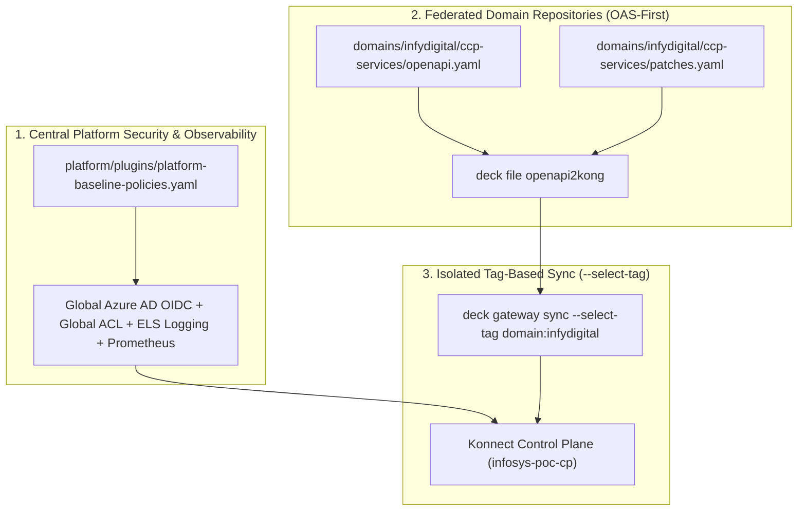

# Production Restructuring Demo & Presentation Guide

**Session Date:** October 6, 2026 | 10:30 AM – 11:30 AM IST  
**Audience:** Muthukumar Subramanian, Veda Bhat, Sabarathinam, Infosys Architecture Team  
**Presenter:** Niraj Adhikari (Kong Field Engineering)

---

## 1. What We Found in the Test Dump (`kong-onprem-gw-test-bkp.yaml`)

When analyzing Veda’s test backup:
* **Total size:** 23.4 MB (742,136 lines) containing **1,231 Services**, **1,802 Routes**, and **418 Upstreams**.
* **The Root Cause of Bloat:**  
  Over **1,794 copies of `openid-connect`** and **1,797 copies of `acl`** are hardcoded into individual routes!
* **The Business Domains Discovered from URI Prefixes:**
  1. `/infydigital/*` (1,253 routes — e.g. `CCPServices`, `DomesticMasterData`)
  2. `/pfapis/*` (267 routes)
  3. `/infyidm/*` (30 routes)
  4. `/onestop/*` (26 routes)
  5. `/alumni/*`, `/infysso/*`, `/icaapp/*`, etc.

---

## 2. The Restructured Production Blueprint (Option A: Federated APIOps)

Instead of maintaining a 742,000-line monolithic file where any change risks breaking 1,200 services:



### Key Innovations:
1. **Deduplication:** Azure AD OIDC (`login.microsoftonline.com/63ce7d59...`), corporate proxy (`blrproxy.ad.infosys.com:443`), and Elasticsearch logging (`10.68.191.97:9200`) are maintained **once** by the platform team.
2. **Domain Isolation via Selective Tagging:**  
   The `infydigital` domain syncs with `--select-tag domain:infydigital`. It touches **only** its 6 entities. It never interferes with `pfapis`, `onestop`, or other teams.
3. **OpenAPI Specification (OAS-First):**  
   Developers define clean contracts (`openapi.yaml`). decK compiles them into gateway routes automatically.

---

## 3. Live Demonstration Walkthrough (Step-by-Step Script)

### Step 1: Show the Problem in the Dump File
Open `docs/kong-onprem-gw-test-bkp.yaml`:
> *"Look at lines 560 to 630. For the very first service (`CCPServices`), we have 250 lines defining Azure AD OIDC and ACL. Scroll to line 960 (`DomesticMasterData`)—the exact same 250 lines are repeated. Across 1,800 routes, that is why this file is 23 Megabytes."*

### Step 2: Show the Clean Domain OpenAPI Spec
Open [`demo-restructured/domains/infydigital/ccp-services/openapi.yaml`](file:///c:/Users/nadhi/source-repos/Infosys-Demo/demo-restructured/domains/infydigital/ccp-services/openapi.yaml):
> *"In our recommended structure, the Digital team only owns their clean OpenAPI 3.0 specification. They define their paths (`/infydigital/CCPServices`), summaries, and status codes."*

### Step 3: Show the Declarative Compilation & Tagging
Run in terminal:
```powershell
deck file openapi2kong -s demo-restructured/domains/infydigital/ccp-services/openapi.yaml | `
  deck file patch demo-restructured/domains/infydigital/ccp-services/patches.yaml | `
  deck file add-tags -o demo-restructured/build/infydigital-ccp-kong.yaml "domain:infydigital" "api:ccp-services"
```
Show output: A clean **67-line** production configuration file with tags:
- `domain:infydigital`
- `api:ccp-services`

### Step 4: Show Isolated Non-Destructive Diff & Sync
Run diff:
```powershell
deck gateway diff demo-restructured/build/infydigital-ccp-kong.yaml `
  --konnect-addr "https://us.api.konghq.com" `
  --konnect-control-plane-name "infosys-poc-cp" `
  --konnect-token "$KONNECT_TOKEN" `
  --select-tag "domain:infydigital"
```
> *"Notice that decK diff only inspects and changes entities tagged with `domain:infydigital`. It is completely blind to and protected from the rest of the 3,000 APIs in Konnect."*

Run sync:
```powershell
deck gateway sync demo-restructured/build/infydigital-ccp-kong.yaml `
  --konnect-addr "https://us.api.konghq.com" `
  --konnect-control-plane-name "infosys-poc-cp" `
  --konnect-token "$KONNECT_TOKEN" `
  --select-tag "domain:infydigital"
```
**Result in Konnect Control Plane:**
- `infosys-digital-ccp-services-api` is live.
- Tags: `domain:infydigital`, `api:ccp-services`.
- Zero blast radius across the rest of the enterprise.

### Step 5: Startup the Local Data Plane (DP) Connected to Konnect
Launch the local Docker Data Plane container mapped to the dedicated Control Plane:
```powershell
.\scripts\start-dp.ps1
```
*(Or on Linux/macOS: `./scripts/start-dp.sh`)*

**What this proves:**
- Connects to Konnect CP (`0646a7d680.us.cp.konghq.com:443`) via mutual TLS (mTLS).
- Allocates free proxy ports:
  - HTTP Proxy: `http://localhost:8010`
  - HTTPS Proxy: `https://localhost:8453`
  - Status API: `http://localhost:8101/status`
- Automatically injects the required Nginx shared dictionary (`kong_rate_limiting_throttling 10m`).
- Demonstrates immediate zero-downtime configuration delivery to the gateway engine (`configuration_hash: ca189072d2936c97ca189072d2936c97`).

### Step 6: Execute the Automated End-to-End Test Suite
Run the automated test script containing end-to-end curl validations:
```powershell
.\scripts\test-e2e.ps1
```
*(Or on Linux/macOS: `./scripts/test-e2e.sh`)*

**What this executes and verifies:**
1. **DP Health & CP Sync:** Confirms non-zero config hash and valid CP timestamp via `/status`.
2. **Protocol Security Enforcement:** Confirms plain HTTP on port `8010` is rejected with `HTTP 426 Please use HTTPS protocol`.
3. **Host Isolation (Negative Test):** Confirms requests with unauthorized Host headers return `HTTP 404 Not Found`, proving cross-tenant security.
4. **HTTPS Route Matching:** Confirms `https://127.0.0.1:8453/infydigital/CCPServices/health` with `Host: itgatewaytst.infosysapps.com` is decrypted and handled by Kong Gateway.
5. **Rate Limiting Advanced Policy:** Confirms rate limit quota headers (`RateLimit-Limit: 50`, `RateLimit-Remaining: 48`) decrement dynamically on each request.

### Step 7: The Fully Automated GitHub Actions APIOps Pipeline
Point Muthu and Veda to [`.github/workflows/kong-konnect-apiops.yml`](file:///c:/Users/nadhi/source-repos/Infosys-Demo/.github/workflows/kong-konnect-apiops.yml):
- **Stage 1 (Validate):** Offline schema validation of all OpenAPI specs via `openapi2kong`.
- **Stage 2 (Lint):** Spectral governance enforcing corporate API guidelines.
- **Stage 3 (Build):** Assembles domain-specific declarative configs with isolated tags (`domain:infydigital`).
- **Stage 4 (Diff):** Selective tagged diffing against `infosys-poc-cp` without touching other domains.
- **Stage 5 (Sync):** Idempotent selective tagged deployment + post-sync zero-drift verification.
