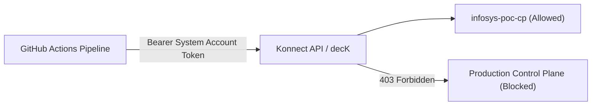
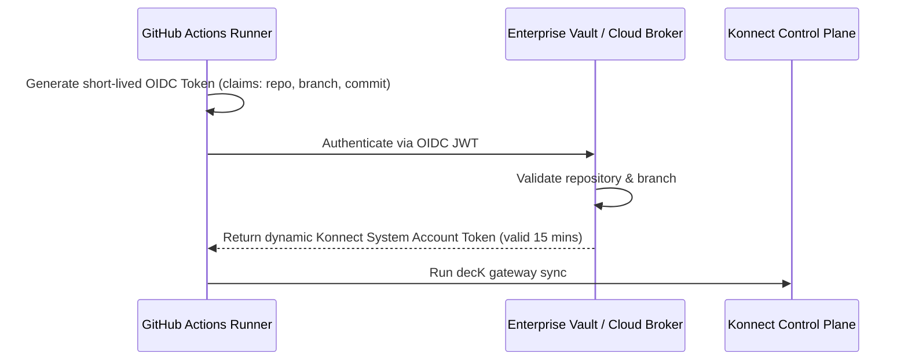

# Authentication Alternatives for Konnect APIOps Pipelines

A field engineering analysis of authentication options when integrating CI/CD pipelines (GitHub Actions, GitLab CI, Azure DevOps, Jenkins) with **Kong Konnect Control Planes**.

---

## 1. Executive Summary & Comparison Matrix

In production enterprise deployments, using a human **Personal Access Token (PAT)** is considered an anti-pattern and a major audit risk. Konnect provides distinct authentication mechanisms designed for machine-to-machine automation.

| Mechanism | Identity Type | RBAC Scoping Granularity | Secret Rotation & Expiry | Recommended Use Case | Production Ready? |
| :--- | :--- | :--- | :--- | :--- | :--- |
| **Personal Access Token (PAT)** | Human User | Inherits full user role (often Organization Admin) | Manual revocation; expires if user leaves or token times out | Local testing, initial rapid POCs | ❌ **No (Anti-pattern)** |
| **Konnect System Account Token** | Machine Identity (System Account) | Scoped strictly to specific Control Plane(s) & permissions (e.g. `Control Plane Admin` on `dev` only) | Configurable lifespan, discrete token lifecycle independent of human employees | Standard CI/CD pipelines across all major enterprises |  **Yes (Recommended Default)** |
| **GitHub Actions OIDC (Workload Identity Federation)** | Ephemeral / Keyless (GitHub JWT) | Scoped to specific Git Repository, Environment, and Branch | Zero stored secrets; tokens minted dynamically per workflow run | High-security banking / cloud-native posture (AWS/Azure/GCP brokers) |  **Gold Standard (Cloud-Broker Pattern)** |
| **Enterprise IdP Service Principal (OAuth2 / OIDC M2M)** | Corporate IdP (Okta / Entra ID) | Centralized enterprise lifecycle governance | Governed by enterprise Key Vault / Secret Manager | Tightly integrated enterprise IAM environments |  **Yes (Advanced Enterprise)** |

---

## 2. Deep Dive: Option 1 — Personal Access Token (PAT)

### How It Works:
A human admin creates a token under **Personal Preferences > Personal Access Tokens** (starts with `spat_...`).

### Pros:
- Takes 30 seconds to generate.
- Great for quick troubleshooting and local debugging.

### Cons & Enterprise Risks:
- **Tied to an Employee:** If the engineer leaves the organization, changes teams, or is deactivated in SSO/Okta, the PAT becomes invalid immediately, causing catastrophic pipeline failures across all environments.
- **Over-Permissioned (Blast Radius):** A PAT inherits the full permissions of the user. If the user is an Organization Admin, the CI/CD pipeline technically has power to delete billing details, modify other Control Planes, or wipe out Portal configs.
- **Audit Compliance Violations:** Violates SOC2, ISO 27001, and PCI-DSS separation-of-duties mandates (actions performed by the CI pipeline appear in audit logs as the human user).

---

## 3. Deep Dive: Option 2 — Konnect System Accounts (Recommended Enterprise Standard)

### How It Works:
A **System Account** is a non-human identity created inside Konnect specifically for automation and service-to-service communication.

### Key Advantages:
1. **Separation of Duties:** Has its own identity in audit logs (e.g., `sa-github-actions-dev`).
2. **Least Privilege RBAC:**
   - Can be granted **Control Plane Admin** on `infosys-poc-cp` only.
   - Denied access to Production Control Planes, User Management, Billing, and Global Audit logs.
3. **Decoupled from Employees:** Employee departures never break pipelines.
4. **Multiple Tokens per Account:** Enables zero-downtime secret rotation (generate token B, update GitHub secret, revoke token A).

### Implementation Steps:
1. In Konnect UI: **Settings > System Accounts > New System Account** (e.g. `sa-apiops-pipeline`).
2. Navigate to **Roles > Add Role**:
   - Entity: `Control Plane`
   - Name: `infosys-poc-cp`
   - Role: `Admin` (or `Editor`)
3. Under **Access Tokens**, click **Generate Token**.
4. Store this token in GitHub Secrets as `KONNECT_TOKEN`.

---

## 4. Deep Dive: Option 3 — Workload Identity / OIDC (The Zero-Secret Pattern)

### How It Works:
Rather than storing long-lived static tokens inside GitHub Secrets (which can leak or expire), GitHub Actions requests an ephemeral **OIDC JSON Web Token (JWT)** minted by GitHub's token authority.

### Why Enterprise Banks Love This:
- **Zero Static Secrets:** Nothing is stored in GitHub repository secrets that could be exported or compromised.
- **Cryptographic Attestation:** Only workflows running from `refs/heads/master` on `nirajmind/infosys-demo` can obtain deployment credentials.

---

## 5. Security & Governance Talking Points for Client Discussions

When presenting to Infosys architecture and security teams, use these strategic points:

> ### 1. "Why we used a PAT for Day 1, and why we will migrate to a System Account for Day 2:"
> *"In our initial enablement session, using our engineer PAT allowed us to validate decK schema generation, verify Spectral linting, and prove connectivity within 30 minutes without waiting on organizational approval tickets.*  
> *For client production and UAT, Kong Professional Services mandates **System Accounts with scoped RBAC**. A dedicated System Account ensures that CI/CD pipelines have strictly bounded blast radiuses, independent secret rotation, and 100% compliance with corporate separation-of-duties audits."*

> ### 2. "How Konnect System Accounts enforce multi-environment isolation:"
> *"Instead of sharing one master token, we create distinct system accounts:*
> - `sa-github-dev`: Restricted to `dev-cp`
> - `sa-github-uat`: Restricted to `uat-cp`
> - `sa-github-prod`: Restricted to `prod-cp` gated by environment review gates.  
> *Even if a developer maliciously or accidentally changes pipeline parameters in Dev, the Dev token will be rejected with `403 Forbidden` if it attempts to touch UAT or Production."*
