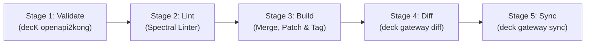

# Kong Konnect APIOps Guide (Infosys POC)

A comprehensive guide for executing declarative APIOps with **Kong Konnect**, **decK**, and **GitHub Actions**.

This pipeline automates the complete lifecycle: validating OpenAPI Specifications (OAS), linting API style, building declarative Kong configurations, diffing against live Konnect state, and synchronizing changes.

---

## 1. Architecture & Pipeline Overview



### The 5 Stages

| Stage | Name | Offline / Online | Purpose |
| :--- | :--- | :--- | :--- |
| **1** | **Validate** | Offline | Verifies that all OAS files can be parsed and converted to Kong declarative format without syntax errors. |
| **2** | **Lint** | Offline | Enforces API style rules and OpenAPI quality standards using `@stoplight/spectral-cli` and `.spectral.yaml`. |
| **3** | **Build** | Offline | Converts domain OAS files to Kong declarative format, applies route/service patches, merges global platform configurations (plugins, consumers, vaults), and applies isolation tags. Generates `build/kong-render.yaml`. |
| **4** | **Diff** | Online (Konnect) | Runs `deck gateway diff` against the target Control Plane. Previews exact additions, modifications, and deletions without changing runtime state. |
| **5** | **Sync** | Online (Konnect) | Runs `deck gateway sync` to apply changes to the live Konnect Control Plane. |

---

## 2. Prerequisites & Setup

### A. Konnect Control Plane
The dedicated POC Control Plane has been provisioned:
* **Control Plane Name:** `infosys-poc-cp`
* **Region Endpoint:** `https://us.api.konghq.com` (US Region for your account)
* **Client Region Endpoint:** `https://in.api.konghq.com` (India Region for client production/POC)

### B. GitHub Secrets & Variables Configuration
In your GitHub repository, navigate to **Settings** > **Secrets and variables** > **Actions**:

#### 1. Repository Secrets (Encrypted)
| Secret Name | Value Description |
| :--- | :--- |
| `KONNECT_TOKEN` | Konnect System Account Token or Personal Access Token (PAT) with Admin / Editor permissions on the Control Plane. |

#### 2. Repository Variables (Configuration)
| Variable Name | Default Value | Notes |
| :--- | :--- | :--- |
| `KONNECT_ADDR` | `https://us.api.konghq.com` | Set to `https://in.api.konghq.com` for India region. |
| `KONNECT_CONTROL_PLANE_NAME` | `infosys-poc-cp` | The target Konnect Control Plane name. |
| `SELECT_TAG` | `infosys-poc-managed` | DecK isolation tag. Prevents touching unmanaged resources. |

---

## 3. Local Execution Guide (decK CLI)

You can run the same pipeline stages on your workstation before pushing code to GitHub.

### Step 1: Set up `.env`
Ensure your `.env` file contains your credentials (or export them in your shell):

```bash
# macOS / Linux
export DECK_KONNECT_TOKEN="spat_xxxx"
export DECK_KONNECT_ADDR="https://us.api.konghq.com"
export DECK_KONNECT_CONTROL_PLANE_NAME="infosys-poc-cp"
export SELECT_TAG="infosys-poc-managed"
```

```powershell
# Windows PowerShell
$env:DECK_KONNECT_TOKEN="spat_xxxx"
$env:DECK_KONNECT_ADDR="https://us.api.konghq.com"
$env:DECK_KONNECT_CONTROL_PLANE_NAME="infosys-poc-cp"
$env:SELECT_TAG="infosys-poc-managed"
```

### Step 2: Validate Specs
```bash
deck file openapi2kong -s flight-data/flights/openapi.yaml | deck file validate -
deck file openapi2kong -s flight-data/routes/openapi.yaml | deck file validate -
deck file openapi2kong -s sales/bookings/openapi.yaml | deck file validate -
deck file openapi2kong -s sales/customer/openapi.yaml | deck file validate -
```

### Step 3: Lint Specs
```bash
npx --yes @stoplight/spectral-cli lint "flight-data/**/openapi.yaml" "sales/**/openapi.yaml" --ruleset .spectral.yaml
```

### Step 4: Build Assembled Configuration
```bash
mkdir -p build/artifacts

# Convert and patch domain APIs
deck file openapi2kong -s flight-data/flights/openapi.yaml | \
  deck file patch flight-data/flights/kong/patches.yaml | \
  deck file add-tags -o build/artifacts/flights-kong.yaml --selector "$.services[*]" --selector "$.services[*].routes[*]" flight-data

deck file openapi2kong -s flight-data/routes/openapi.yaml | \
  deck file patch flight-data/routes/kong/patches.yaml | \
  deck file add-tags -o build/artifacts/routes-kong.yaml --selector "$.services[*]" --selector "$.services[*].routes[*]" flight-data

deck file openapi2kong -s sales/bookings/openapi.yaml | \
  deck file patch sales/bookings/kong/patches.yaml | \
  deck file add-tags -o build/artifacts/bookings-kong.yaml --selector "$.services[*]" --selector "$.services[*].routes[*]" sales

deck file openapi2kong -s sales/customer/openapi.yaml | \
  deck file patch sales/customer/kong/patches.yaml | \
  deck file add-tags -o build/artifacts/customer-kong.yaml --selector "$.services[*]" --selector "$.services[*].routes[*]" sales

# Merge with Platform baseline and add managed tag
deck file merge \
  build/artifacts/flights-kong.yaml \
  build/artifacts/routes-kong.yaml \
  build/artifacts/bookings-kong.yaml \
  build/artifacts/customer-kong.yaml \
  experience/kong/experience-service.yaml \
  platform/kong/platform-kong-base.yaml \
  platform/kong/consumers/consumers.yaml \
  platform/kong/consumers/groups.yaml \
  platform/kong/plugins/acme.yaml \
  platform/kong/plugins/rate-limiting-advanced.yaml \
  platform/kong/vaults/aws-secrets-manager.yaml | \
deck file patch platform/kong/patches.yaml | \
deck file add-tags -o build/kong-render.yaml "$SELECT_TAG"

# Validate generated config
deck file validate build/kong-render.yaml
```

### Step 5: Diff against Live Konnect
```bash
deck gateway diff build/kong-render.yaml --select-tag "$SELECT_TAG"
```

### Step 6: Sync to Live Konnect
```bash
deck gateway sync build/kong-render.yaml --select-tag "$SELECT_TAG"
```

---

## 4. Key decK Concepts for Customer Sessions

When presenting this demo to client stakeholders:

1. **Why decK?**  
   Direct API scripts make state management, drift detection, and automated rollback difficult. `deck gateway diff` and `deck gateway sync` provide an idempotent, Git-driven workflow where Git is the single source of truth.
2. **Selective Tagging (`--select-tag`):**  
   The `--select-tag infosys-poc-managed` flag ensures decK **only touches entities managed by this pipeline**. Unmanaged services or manual configurations in Konnect are left untouched.
3. **Decoupled Architecture:**  
   Domain teams manage their API specs (`openapi.yaml`) and local routing patches (`patches.yaml`). The Central Platform Team manages global authentication, rate limiting, and consumer groups in `platform/kong/`.
